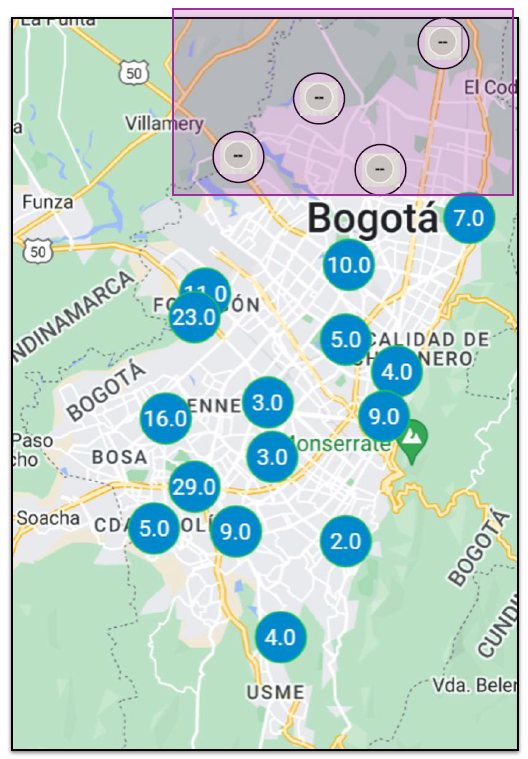

# Missing Data

<figure>
  
  <figcaption>Map of Bogotá displaying air quality sensor readings, highlighting the unequal distribution of sensors across the city and the presence of gaps in data collection, which underscore the challenges of data inequality and missing information in AI-based environmental monitoring systems.</figcaption>
</figure>

- **Importance of Sensor Data in AI**: Sensor data is essential for AI applications, providing the raw input for environmental monitoring and public health management.

- **Data Inequality in Sensor Distribution**: Unequal placement of sensors, often concentrated in more affluent areas, leads to gaps in data coverage and reflects broader societal inequalities.

- **Impact on Underserved Communities**: Areas with fewer sensors, typically less affluent, may lack critical data, putting residents at greater risk of health issues due to unmonitored air quality.

- **Challenges of Missing Data**: Missing data from sensors due to malfunctions or maintenance can undermine the accuracy and reliability of AI models.

- **Techniques to Handle Missing Data**: AI systems can use methods like data imputation or robust modeling to manage and mitigate the effects of missing data.

- **Need for Equitable AI Implementation**: To ensure AI benefits all segments of society, data collection must be equitable, and AI models must be designed to handle data gaps effectively.

- **Social Responsibility in AI**: Addressing data inequality and missing data in AI systems is crucial for building socially responsible and reliable AI solutions that serve the public good.

