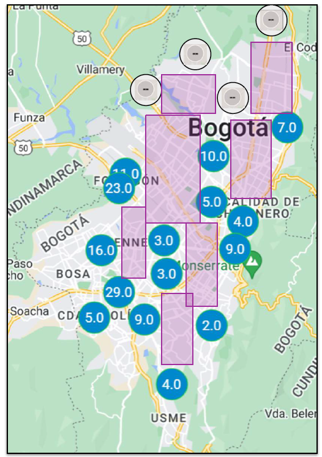

# Partial Data

<figure>
    
    <figcaption>Map highlighting areas of Bogotá where air quality data is only partially available. The presence of partial data can significantly impact the effectiveness of AI models, leading to challenges in accurately predicting and managing air quality, especially in under-monitored regions.</figcaption>
</figure>

- **Definition of Partial Data**: Partial data refers to datasets where some, but not all, of the expected data is available, leading to incomplete information for analysis.

- **Impact on AI Model Performance**: Incomplete data can reduce the accuracy and reliability of AI models, as the missing portions may contain crucial information that influences predictions.

- **Challenges in Data Analysis**: Partial data can complicate data analysis, making it difficult to draw accurate conclusions or identify trends, especially when the missing data is not uniformly distributed.

- **Techniques for Managing Partial Data**: Methods such as interpolation, data augmentation, and model-based imputation can be used to estimate and fill in missing portions of the data.

- **Risks of Bias in Partial Data**: Partial data can introduce bias, particularly if the missing data is systematically related to certain variables, leading to skewed results.

- **Importance of Contextual Understanding**: Understanding the context and reasons for the partiality of the data is crucial for selecting the appropriate method to handle it and ensuring that AI models remain robust.

- **Ethical Considerations**: When dealing with partial data, it is essential to consider the ethical implications, especially in critical applications like healthcare, where decisions based on incomplete information could have serious consequences.

- **Role of Domain Expertise**: Involving domain experts can help in understanding the significance of the missing data and in developing strategies to compensate for its absence in AI models.

